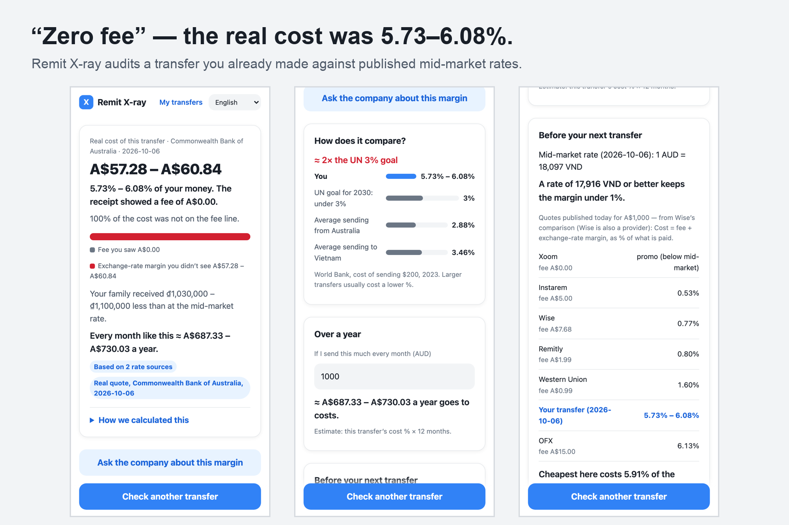
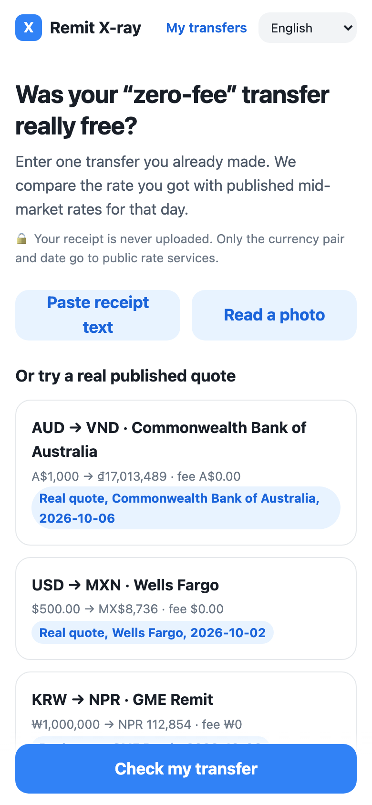
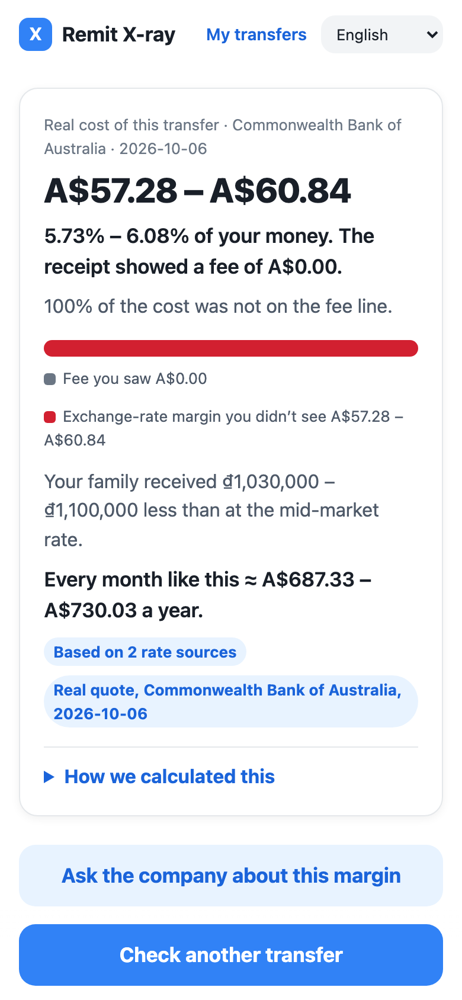
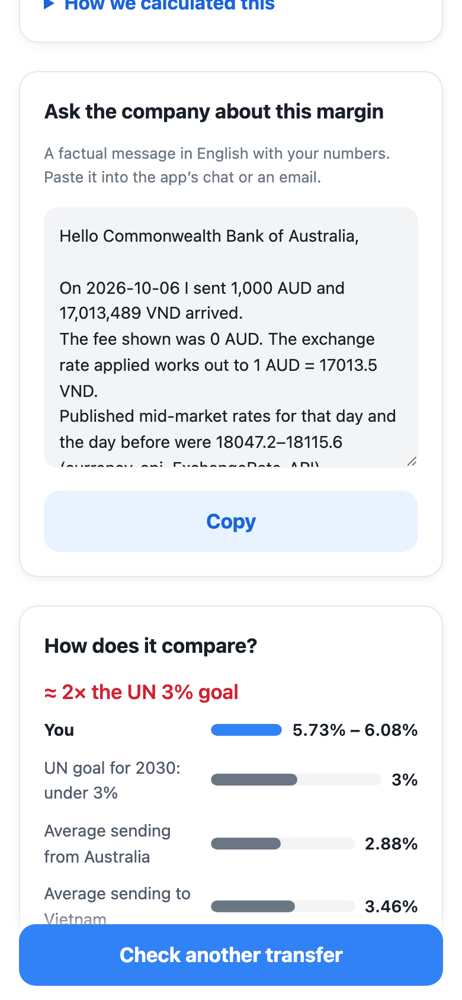
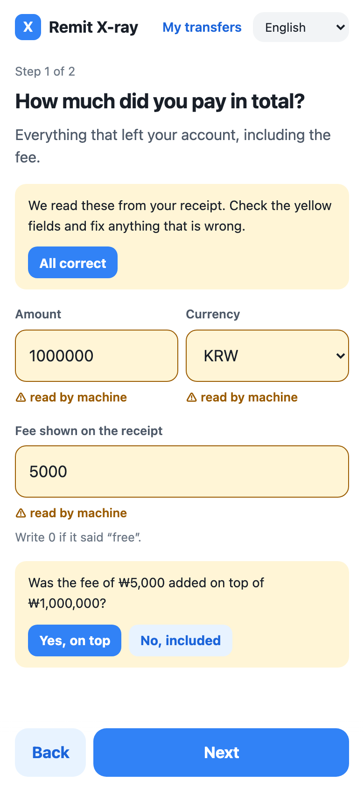
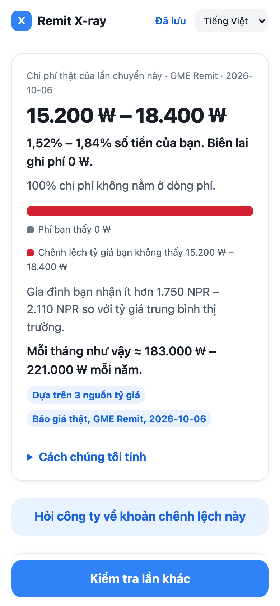
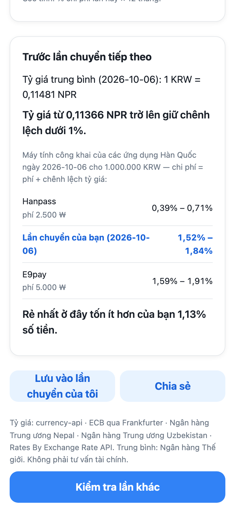

# Remit X-ray

**"Zero fee" — so what did the transfer really cost?**
Enter one money-transfer receipt you already have. Remit X-ray compares the rate you got with published mid-market rates for that day and shows the cost hidden in the exchange rate — in money, in percent, per year, and in what your family did not receive. Then it gives you something to do with it: a factual question to send the company, and today's prices for the same route on the same scale.

**Live:** https://ryugi62.github.io/remit-xray/ · one-tap sample (a bank's "A$0 fee" transfer to Vietnam): https://ryugi62.github.io/remit-xray/?sample=0
United Hackathons V1 — track **Economic** ("Design tools that promote financial inclusion…").




## Why
A migrant worker sending money home usually sees one number on the receipt: the fee. Many apps and banks advertise it as 0. The other cost — a worse exchange rate than the mid-market rate — is not printed anywhere, so it cannot be compared, questioned, or added up over a year.

World Bank (cost of sending $200, including the exchange-rate margin, 2023, `SI.RMT.COST.OB.ZS`): **4.19 %** average from South Korea, **3.51 %** from the United States. The UN target (SDG 10.c) is **under 3 %**.

Quote-comparison sites help *before* you send. Remit X-ray **audits the transfer you already made**.

## What we found in real prices
From the 61 real quotes in [`vectors/`](vectors/) (`python3 scripts/findings.py` prints these):
- 61 real quotes · 25 provider names · 9 corridors · priced on 2026-10-02 (8) and 2026-10-06 (53). 52 were collected through Wise's public comparison API (Wise is itself a provider); 9 were read by hand from the Hanpass, GME Remit and E9pay public calculators. NatWest and RBS are one banking group and quote the same price.
- **14 of 19 "zero-fee" quotes still cost money through the rate: median 1.63 %, up to 6.08 %** — the most expensive were big banks (Commonwealth Bank of Australia → Vietnam 5.73–6.08 %, Wells Fargo → Mexico 3.38–4.71 %).
- Among quotes that *do* show a fee and also take a margin, the margin was the bigger part of the cost in 29 of 31 (median 76 % of the total).
- The Korean remittance apps were among the cheapest (0.4–2.9 %) — the point is not "app X is bad", it is that **the fee line alone can't tell you which case you are in**.

## How it works
1. **Enter** what you paid, the fee shown, what arrived, and the date — or paste the receipt text, or read a photo on the phone. Values read by the machine (and defaults such as today's date) are yellow and are not used until you confirm them. If a fee looks like it was charged on top, the app asks.
2. **Reference band.** For the day before and the day of the transfer, the page fetches mid-market rates from every public source that has the pair: [currency-api](https://github.com/fawazahmed0/exchange-api), [ECB via Frankfurter](https://frankfurter.dev), the central banks of the receiving country where available — [Nepal Rastra Bank](https://www.nrb.org.np/forex/) (NPR) and the [Central Bank of Uzbekistan](https://cbu.uz/en/arkhiv-kursov-valyut/) (UZS) — and [ExchangeRate-API](https://www.exchangerate-api.com) (today only). The band is the lowest–highest of those rates, and the result says how many sources it rests on (one source = "lower confidence"). No source → no answer; a result that would mean a margin below −5 % or above 20 % is refused as a probable typo.
3. **Audit.**
   `effective rate = received ÷ (paid − fee)` · `margin = 1 − effective ÷ reference` (at both ends of the band) · `real cost = fee + (paid − fee) × margin`
   The answer is a **range**, never a fake-precise single number.
4. **Context and action.** UN 3 % goal and World Bank averages for the route (noting they are for $200), a yearly estimate, a ready-to-copy **message to the company** (numbers, sources, one question — no accusation), today's quotes for the same route ranked on the same cost scale with your transfer in the list (Korean routes: the three Korean apps' calculators; other routes: Wise's public comparison, fetched only when you tap), and a saved-transfers list you can copy as text.

## Can you trust the numbers?
- **Checked against an outside measurement.** For each of the 52 quotes it collects, Wise publishes the provider's margin over Wise's own mid-market rate. Our range (daily rates) contains that published margin within **±0.30 percentage point in 52 of 52** (19 exactly inside; largest miss 0.30 pp). Daily rates cannot see the minute a provider priced a transfer, so differences that small are treated as "no margin": the zero-margin quotes are never called a markup or a promotion. Both are tests that run on every push (`tests/vectors.test.mjs`).
- **Two implementations.** `vectors/compute_expected.py` is a separate Python `Decimal` implementation that fetches the rates itself (its own HTTP code, not the app's adapters) and freezes the band and the expected result; the JavaScript engine must match every vector to ±0.01 pp. This checks the arithmetic; the calibration above checks the answer.
- **Samples never drift.** The one-tap samples replay the rates recorded when the quote was collected, so they give the same answer on any day, even offline.
- **Tests:** `npm test` (Node ≥ 20, no dependencies) — domain math, parser (including real SMS formats), draft confirmation, fee-on-top, plausibility, adapters with fake fetch, reports, i18n completeness, formatting, layer rules, calibration and every vector. CI runs them on every push.
- **Clean architecture.** `src/domain` knows nothing about the network or the page; `src/application` imports only the domain; `src/adapters` (rate APIs, central banks, Wise quotes, OCR, storage) and `src/ui` sit outside. A test fails if a layer imports the wrong way. Spec with numbered acceptance criteria: [SPEC.md](SPEC.md).

## Privacy
Receipts and photos are never uploaded (OCR is tesseract.js in the browser). Rate services receive only the currency pair and date. Wise's comparison receives the pair and amount — only when you tap "Compare with today's published quotes". Saved transfers stay in this browser.

## Limits (said plainly)
- No user study: this was built solo in a week, and no migrant worker has tested it yet. The Korean calculator quotes were read by hand; no screenshots were kept (the transcription log is in `vectors/evidence/`).
- Rates are daily, not intraday (hence the range and the ±0.30 pp tolerance). No central-bank feed is used for VND yet, so KRW→VND rests on currency-api and ExchangeRate-API.
- Photo reading works best on clear screenshots; every machine-read field must be confirmed.
- Information, not financial advice; it does not name a "best" provider.

## Screens
| | | |
|---|---|---|
|  |  |  |
|  |  |  |

Languages: English, 한국어, Tiếng Việt, नेपाली, O'zbekcha. Non-English strings were drafted with AI help and checked for meaning, not by native speakers — corrections welcome.

## Run locally
```
python3 -m http.server 8000   # then open http://localhost:8000
npm test
python3 vectors/compute_expected.py   # re-fetch rates and rebuild vectors/receipts.json
python3 scripts/build_data.py         # World Bank context, samples, Korean quotes
python3 scripts/findings.py           # the numbers above
```

## Built during the hackathon
All code was written from 2026-10-06 (hackathon window: Oct 5–11, 2026 PT) by Taegeol Kim (solo), with AI coding assistance. MIT license.
