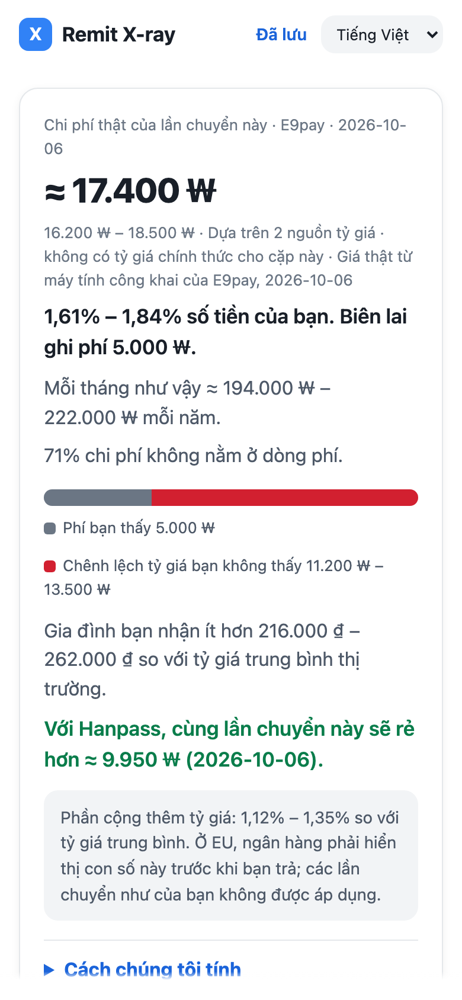

# Remit X-ray

**Your bank said "zero fee". Your family got less. Remit X-ray shows how much — from the receipt you already have.**

Why that number is missing: in the EU, Regulation (EC) No 924/2009 (Art. 3a–3b, added by Regulation (EU) 2019/518) makes payment providers show currency-conversion charges as a % mark-up over the ECB reference rate — for card payments and credit transfers with a currency conversion in the Union. A worker sending money from Korea to Nepal, from Australia to Vietnam or from the US to Mexico is not covered and never sees that number. In the US, Regulation E (12 CFR 1005.31) makes most remittance providers print the fee, the exchange rate and the amount received on the receipt — exactly the inputs Remit X-ray needs.

**Remit X-ray turns the receipt you already have into that missing disclosure**: the mark-up over published mid-market rates, in percent and in money, what the cheapest listed option would have cost for the same transfer, and a factual question you can send the company. It works **after** you send (audit a receipt) and **before** (check a quote).

**Live:** https://ryugi62.github.io/remit-xray/ · one-tap sample (a bank's "A$0 fee" transfer to Vietnam): https://ryugi62.github.io/remit-xray/?sample=0
United Hackathons V1 — track **Economic** ("Design tools that promote financial inclusion…").


## Why
The receipt shows one cost: the fee. Many apps and banks advertise it as 0. The other cost — a worse exchange rate than the mid-market rate — is never printed, so it cannot be compared, questioned, or added up.

World Bank (cost of sending $200, including the exchange-rate margin, 2023, `SI.RMT.COST.OB.ZS`): **4.19 %** average from South Korea, **3.51 %** from the United States. The UN target (SDG 10.c) is **under 3 %**.

Quote-comparison sites (Wise's comparison, Monito) help *before* you send and are run by a provider or paid by referrals. Remit X-ray is neutral (it lists Wise as a provider like any other), audits *your* receipt, and keeps it on your phone.

## What we found in real prices
From the 61 real quotes in [`vectors/`](vectors/) (`python3 scripts/findings.py` prints all of these):
- 61 quotes · 25 provider names · 9 corridors · priced on 2026-10-02 (8) and 2026-10-06 (53). 52 were collected through Wise's public comparison API (Wise is itself a provider); 9 were read by hand from the Hanpass, GME Remit and E9pay public calculators. NatWest and RBS are one banking group and quote the same price.
- **14 of 19 "zero-fee" quotes still cost money through the rate: median 1.63 %, up to 6.08 %.** The most expensive were big banks: Commonwealth Bank of Australia → Vietnam 5.73–6.08 %, Wells Fargo → Mexico 3.38–4.71 %.
- Among quotes that *do* show a fee and also take a margin, the margin was the bigger part of the cost in 29 of 31 (median 76 % of the total).
- Korean apps (mid-points 0.55–2.68 %) sit mostly at or below the dataset median (1.95 %); Hanpass was the cheapest of the three on all three Korean routes. Sending ₩1,000,000 (+ ₩5,000 fee) to Vietnam with E9pay instead of Hanpass cost ≈ ₩9,950 more per transfer. The point is not "app X is bad": **the fee line alone can't tell you which case you are in.**

## How it works
1. **Enter** what you paid, the fee shown, what arrived, and the date — or paste the SMS/app text, or read a photo on the phone. Values read by the machine (and defaults such as today's date) are yellow and are not used until you confirm them; an ambiguous date (05/10) must be picked; any fee triggers "was it added on top?" unless the receipt shows the total withdrawn. Amounts are accepted as receipts print them (`1,000,000`, `1.000.000`, `2,5`).
2. **Reference band.** For the day before and the day of the transfer, the page fetches mid-market rates from every public source that has the pair: [currency-api](https://github.com/fawazahmed0/exchange-api) (a community aggregator), [ECB via Frankfurter](https://frankfurter.dev), the receiving country's central bank where available — [Nepal Rastra Bank](https://www.nrb.org.np/forex/) (NPR), [Central Bank of Uzbekistan](https://cbu.uz/en/arkhiv-kursov-valyut/) (UZS) — and [ExchangeRate-API](https://www.exchangerate-api.com) (today only). The band is the lowest–highest of those rates; the result says how many sources it rests on and flags one source as "lower confidence". No source → no answer. A margin below −5 % or above 20 %, or a fee above 20 %, is refused as a probable typo.
3. **Audit.** `effective rate = received ÷ (paid − fee)` · `mark-up = 1 − effective ÷ reference` (at both ends of the band) · `real cost = fee + (paid − fee) × mark-up`. The answer is a range: **markup** (even the generous end is above 0.30 pp), **no evidence of a margin**, **better than mid-market** (a promotion), or **can't tell** (the band is too wide — shown as such, never as "matched").
4. **What to do with it.** Other quotes ranked on the same scale (fee + margin against the same kind of mid-market range) with your transfer in the list, and what the cheapest would have cost: Korean routes use the three apps' calculators rescaled to your amount; the samples use the quotes collected the same day; other routes use Wise's public comparison for today, scored against today's band (fetched only when you tap). Plus a ready-to-copy **message to the company** (numbers, sources, one question — no accusation), UN 3 % and World Bank comparisons (noting those are for $200), a yearly estimate, saved transfers you can copy as text, and a share link that carries only the receipt so anyone can re-run the same audit.

## Can you trust the numbers?
- **Checked against an outside measurement — said precisely.** For each of the 52 quotes it collects, Wise publishes the provider's margin over Wise's own mid-market rate. Our daily range contains it exactly in 19 of 52; the largest miss is 0.30 pp, and **that is where the 0.30 pp tolerance comes from** (it was fitted on these same quotes). Held out by route — tolerance fitted on the other routes, tested on the one left out — it covers **43 of 52**. The misses are one-directional per route: USD→MXN sits 0.20–0.30 pp above Wise's view (all 9 quotes), GBP→INR 0.09–0.15 pp below. That is why results are ranges, why "can't tell" exists, and why zero-margin quotes are never called a markup. These are tests that run on every push (`tests/vectors.test.mjs`).
- **Two implementations.** `vectors/compute_expected.py` is a separate Python `Decimal` implementation with its own HTTP code that freezes the band and the expected result; the JavaScript engine must match every vector to ±0.01 pp. This checks the arithmetic; the calibration above checks the answer.
- **Samples never drift.** The one-tap samples replay the rates recorded when the quote was collected — same answer on any day, even offline.
- **Tests:** `npm test` (Node ≥ 20, no dependencies) — domain math and classification, parser (SMS-style formats in Korean, English and Vietnamese, including a Korean bank's outbound SMS layout), draft confirmation, fee on top, plausibility, quote rescaling, share links, adapters with fake fetch, reports, i18n completeness, formatting, layer rules, calibration and every vector. CI runs them on every push.
- **Clean architecture.** `src/domain` knows nothing about the network or the page; `src/application` imports only the domain; `src/adapters` (rate APIs, central banks, Wise quotes, OCR, storage) and `src/ui` sit outside; a test fails if a layer imports the wrong way. Spec with numbered acceptance criteria: [SPEC.md](SPEC.md).

## Who this reaches
- Senders on the routes we cover best: Korea → Vietnam, Nepal, Uzbekistan (the three Korean apps' prices, both central banks for NPR/UZS), plus any pair a public source covers (US → Mexico/Philippines, UK → India, Australia → Vietnam…).
- In their language (vi, ne, uz, ko, en), on the phone they already use, with nothing to install or sign up for.
- Through the channels they already share links in: a result is one link (Open Graph preview for KakaoTalk, Zalo, WhatsApp), and a sample works offline. Printed QR posters for migrant-worker centres are the next step — not distributed yet.

## Privacy
Receipts and photos are never uploaded (OCR is tesseract.js in the browser, Korean always loaded). Rate services receive only the currency pair and date. Wise's comparison receives the pair and amount only when you tap "Compare with today's published quotes". A share link contains the receipt's amounts — only if you choose to share. Saved transfers stay in this browser.

## Limits (said plainly)
- No user study: built solo in a week; no migrant worker has tested it yet, and it has not been distributed. The Korean calculator quotes were read by hand with no screenshots kept (transcription log in `vectors/evidence/`). The parser fixtures are SMS-*style* texts written for the tests, not collected messages.
- For past KRW→VND receipts the band rests on currency-api alone (ExchangeRate-API only answers for today; the ECB has no VND) — the app shows "1 rate source — lower confidence".
- Rates are daily, not intraday (hence ranges and the tolerance). Korean app fees are as shown for ₩1,000,000 and may differ at other amounts.
- Information, not financial advice; it names the cheapest *listed* option for one transfer, not a "best" provider. A better-than-mid-market quote (usually a first-transfer offer) is shown on its own line, not counted as "cheapest".
- The UN 3 % goal and World Bank averages are for $200 transfers; larger transfers usually cost a lower %.

## Screens
| | | |
|---|---|---|
|  |  |  |
|  |  |  |

Languages: English, 한국어, Tiếng Việt, नेपाली, O'zbekcha. Non-English strings were drafted with AI help and checked for meaning, not by native speakers — corrections welcome.

## Run locally
```
python3 -m http.server 8000   # then open http://localhost:8000
npm test
python3 vectors/compute_expected.py   # re-fetch rates and rebuild vectors/receipts.json
python3 scripts/build_data.py         # World Bank context, samples, Korean quotes
python3 scripts/findings.py           # the numbers above
```

## Built during the hackathon
All code was written from 2026-10-06 (hackathon window: Oct 5–11, 2026 PT) by Taegeol Kim (solo), with AI coding assistance. MIT license.
